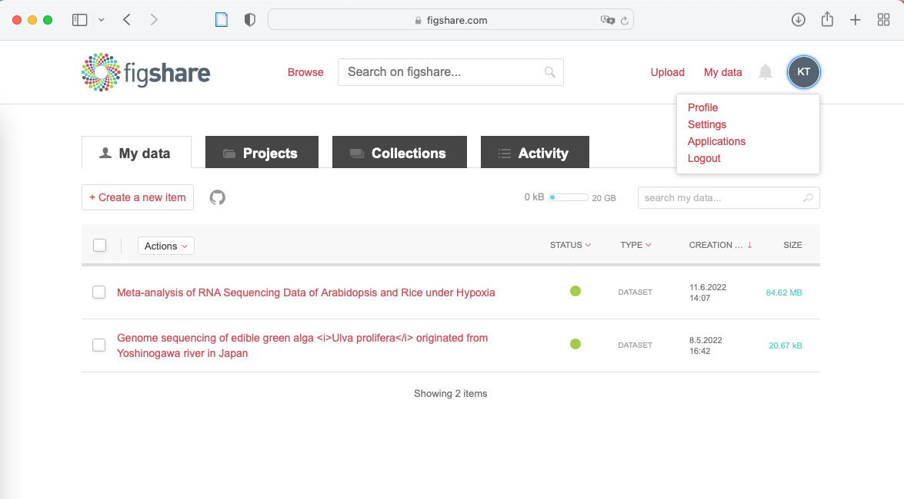

# 統合データベース講習会 AJACSオンライン11「論文を検索・整理・執筆する」: figshareなどのデータ･図表リポジトリを使って研究データを適切に共有する
2022年7月28日 
広島大学大学院統合生命科学研究科 
田村 啓太 (Keita Tamura) | [figshare プロフィール](https://figshare.com/authors/Keita_Tamura/12496780) 

---
- これは統合データベース講習会 AJACSオンライン11「論文を検索・整理・執筆する」: figshareなどのデータ･図表リポジトリを使って研究データを適切に共有する、の講習資料です。
- 講習会では、こちらのページをスクロールしながら説明を進めます。
- 受講者事前アンケートへのご協力ありがとうございました。結果は後ほど紹介します。
- Licensed under [CC BY 4.0](https://creativecommons.org/licenses/by/4.0/deed.ja) © 2022 Keita Tamura

---
# 自己紹介
田村 啓太 (Keita Tamura)
- 広島大学 [坊農秀雅特任教授の研究室 (bonohulab)](https://bonohu.hiroshima-u.ac.jp) に所属する研究員
    - 所属当初からオープンサイエンスの重要性について叩き込まれる
- これまでの研究歴
    - 有機化学 (学部4年)→植物代謝工学 (大学院博士前期・後期)→植物病理学 (民間企業)→植物ゲノム解析、バイオインフォマティクス (現在)
- 植物のつくる多様な代謝物に興味をもって研究しています

---
# 講習の流れ
### はじめに
- 受講される方へのお願いと注意事項

### 序論
- なぜ研究データの公開・共有が重要か
- データ共有の原則: FAIR原則
- グローバルに一意で永続的な識別子（ID）
- データリポジトリを通じた研究データの登録
- 代表的な汎用リポジトリ
- 論文のSupplementary Information (SI) もリポジトリへの登録が推奨されてきている
- 論文中のデータをリポジトリに登録する方法
- ここまでのまとめ

### figshareの使い方 (実践編)
- figshareの特徴
- 【デモ】figshare内を検索してみよう (アカウント不要)
    - 【デモ】 個々のitem (データ) を見てみよう
    - データのライセンスについて
- figshareにデータを登録する流れ
    - figshareのアカウントの取得
    - プロフィールページの設定
    - 【デモ】ファイルをアップロード
    - 【デモ】メタデータの入力画面
    - 【デモ】プレビュー表示を確認
    - figshareのitemとcollectionについて
    - データの公開 (publish)
    - データ公開後の修正
- まとめ

---
# 受講される方へのお願いと注意事項
- 【デモ】と書かれた項目については、講師が実際のウェブサイト上での操作の様子をお見せします
    - 多くの方が同時にアクセスするとつながりにくくなる恐れがあります。その際は後ほど時間を置いてから実行してみてください
- **研究データの公開は必ず関係者の許可・同意を得てから行ってください**
    - 研究室の管理者 (PI、指導教員など)、共同研究者など、関係者の許可・同意を必ず取ってください
    - 特に特許出願を予定しているデータ、個人情報が含まれるデータを公開してしまうと大問題です。十分に注意してください
- 本講習では「研究データの共有」について説明しますが、公開しても差し支えない研究データ、という前提で話を進めます。

---
# なぜ研究データの公開・共有が重要か
- 研究インパクトの向上
    - データを公開している論文は公開していない論文よりも最大30%引用されやすいという調査結果がある (*1,2)
- 研究の再現性の担保と透明性の向上
    - データを公開することで、第3者が検証実験を行うことが可能になり、研究の再現性の担保と透明性向上につながる (*1)
- 科学の発展に対する貢献
    - 公開されたデータを利用することで仮説立案から検証までをハイスループットに実施できる (データ駆動型研究) (*3)
    - データ駆動型研究の有名な例: iPS細胞の山中4因子は、理化学研究所のFANTOMデータベースを使って見いだされた
- 論文の引用が研究業績として認識されているのと同様に、研究データも引用され、研究業績として認めていこうという流れがある (*4)
- 参考資料
    - *1: [MAKE YOUR DATA DISCOVERABLE](https://libraries.ou.edu/content/make-your-data-discoverable)
    - *2: [https://doi.org/10.7717/peerj.175](https://doi.org/10.7717/peerj.175)
    - *3: [NBDCワークショップ報告書「データ駆動型研究の推進と課題」(2020年12月1日開催)](https://biosciencedbc.jp/about-us/report/workshop-2020-report-data-driven-research/)
    - *4: [CA1980 - データ引用を研究活動の新たな常識に](https://current.ndl.go.jp/ca1980)

---
# データ共有の原則: FAIR原則
 
SangyaPundir, CC BY-SA 4.0, via Wikimedia Commons

- FAIR原則: データの公開・共有の適切な実施方法を表したもの
    - **F**indable (見つけられる)
    - **A**ccessible (アクセスできる)
    - **I**nteroperable (相互運用できる)
    - **R**eusable (再利用できる)
- FAIR原則の正式な日本語版: [NBDC研究チーム(訳),「THE FAIR DATA PRINCIPLES」和訳](https://doi.org/10.18908/a.2019112601)
    - 前文で、いわゆるデータ駆動型科学の思想を宣言
    - 各項目はさらに細分化されており、合計15の原則から構成される

---
# グローバルに一意で永続的な識別子（ID）
- FAIR原則のF1: （メタ）データが、グローバルに一意で永続的な識別子（ID）を有すること
    - 研究データの共有で最も重要なポイント
- 塩基配列データのaccession番号も「グローバルに一意で永続的な識別子（ID）」の一つ
    - accession番号が分かればその遺伝子の配列やRNA-Seqの生データの所在にたどりつける
- より一般的には、**DOI** (Digital Object Identifier) と呼ばれるデジタルコンテンツに付与される国際的な識別子(ID)が使われる
    - DOIはコンテンツの所在情報 (URL) に変換され、**コンテンツの所在が変わってもリンク切れを起こさない**ようになっている
 
https://doi.org/10.11502/rduf_rdc_doileaflet

---
# データリポジトリを通じた研究データの登録
- データリポジトリ (data repository) とは、データの「置き場、保管場所」のこと
- 研究データに応じた適切なデータリポジトリに登録することで、「グローバルに一意で永続的な識別子（ID）」が付与される
- データに適した専用のリポジトリがあればそれを利用する
    - 例: DDBJに塩基配列データを登録する
    - 研究分野ごとに特定のデータを格納するリポジトリが用意されている
        - 参考: [scientific data誌のData Repository Guidance](https://www.nature.com/sdata/policies/repositories)
- 専用のリポジトリが存在しないデータの場合
    - 自らデータベースを構築してDOIを付与して運用する
        - 長期的な研究データ管理を可能にする体制が求められる
        - 参考: https://doi.org/10.11502/rduf_rdc_doileaflet
    - 自ら構築したデータベースをNBDCの[生命科学系データベースアーカイブ](https://dbarchive.biosciencedbc.jp/index.html)に寄託する
        - データベース単位でDOIが付与される 
        
    - **figshareなどの汎用リポジトリ (generalist repository) にデータを登録する**
        - 自らデータベースを構築することなく、あらゆる形式のデータを登録することが可能
        - 登録したデータにはDOIが付与される

---
# 事前アンケートへのご協力ありがとうございました
回答数: 245 (7月13日現在) 
【設問6-1】データリポジトリに研究データを登録したことがありますか？
||人数|割合|
|:--|--:|:--:|
|ある|16 名|6.5 %|
|ない|229 名|93.5 %|

【設問6-2】使用されたデータリポジトリを選択してください (複数回答可)
||回答数|
|:--|--:|
|figshare|3 票|
|Zenodo|3 票|
|Dryad|1 票|
|その他|8 票|

その他内訳:  
配列データ関連 (DDBJ, DRA, NCBI, SRA), 6票 
JPost, 1票 
GitHub, 1票

---
# 代表的な汎用リポジトリ
- 論文出版社の投稿規定や、また大学図書館による汎用リポジトリの説明では、[figshare](https://figshare.com), [Dryad](https://datadryad.org/stash), [Zenodo](https://zenodo.org)が代表的なツールとしてよく紹介されている印象
- このうち原則無料で使えるのはfigshareとZenodo
    - Dryadは契約のある研究機関あるいは出版社経由以外からはデータ登録料 ($120 USD) が必要
    - figshareとZenodoは誰でも無料で利用可能
        - 1ファイルの上限がfigshareは20 GB、Zenodoは50 GB
- (個人的にZenodoと比較してfigshareが優れていると思う点): データにアクセスされやすい仕組みが随所に見られる
    - figshareはファイルのプレビュー機能が充実
    - figshareにはユーザーのプロフィールページがあり、その研究者が登録したデータの一覧が見られる
- 参考: [NIH Workshop](https://datascience.nih.gov/data-ecosystem/NIH-data-repository-workshop) (2020年2月)を受けて発行された比較表 (https://doi.org/10.5281/zenodo.3946720) 
 

---
# 論文のSupplementary Information (SI) もリポジトリへの登録が推奨されてきている
 
参考記事: https://www.the-scientist.com/news-opinion/the-push-to-replace-journal-supplements-with-repositories--66296
- SIにも永続性を持ったDOIをつけて登録できるため、出版社の都合などでアクセスできなくなる恐れがない
- 機械可読 (コンピュータが自動的に読み込んで処理できる) な形式で登録できる
    - 論文投稿時に添付ファイルとして登録する場合、表データも含めてPDFなどの機械可読でない形式に変換されることが多い
- SIのデータ自体を別途引用してもらうことができる
- 出版社の投稿規定でも、リポジトリへの登録を義務付けあるいは強く推奨する流れが出てきている
    - F1000Research: SIの添付を受け付けずリポジトリの引用が必須
    - PLOS journals: リポジトリの引用を強く推奨。SIの添付も可能だが、出版社側でfigshareに自動アップロードされる

---
# 論文中のデータをリポジトリに登録する方法
1. 論文投稿プロセスの中で、提携しているリポジトリに登録
- figshareは30を超える出版社と提携: ([Publishers list](https://knowledge.figshare.com/type-of-client/publishers))
- figshareに登録されているデータも、出版社経由が圧倒的に多い 
    
2. 論文投稿とは別にリポジトリにデータを登録して、論文中で引用
- 査読中非公開にしたい場合は、privateリンクを共有することで対応可能
- DOIとともに論文中で引用する
- 実例: https://doi.org/10.1038/s41467-022-30902-7
    - 論文中のfigureおよびSIのソースファイルをfigshareに登録している例 
        

---
# ここまでのまとめ
- 論文だけではなく研究データも公開・共有することが求められるようになってきている
- FAIR原則に則ってデータを共有することが重要
- データの種類に応じた専用のリポジトリがある場合はそちらに、ない場合はfigshareなどの汎用リポジトリに登録することが推奨される 
     
SangyaPundir, CC BY-SA 4.0, via Wikimedia Commons

---
# figshareの特徴
- 無料アカウントで20 GBまでのファイルをアップロードできる
    - 下書き状態 (private) の合計容量は20 GBだが、公開されたファイルの容量は無制限
- データ公開前からDOIを予約することができ、データを公開すると即座にDOIが有効になる
- ウェブブラウザ上で多くのファイル形式のプレビューが可能

---
# 【デモ】figshare内を検索してみよう (アカウント不要)
ここでは使い方の一例として、Google画像検索のようにシロイヌナズナの画像を探してみましょう
1. [https://figshare.com](https://figshare.com)にアクセス
2. 画面上部の検索窓に"Arabidopsis"と入力して「虫眼鏡マーク」をクリック 
    
3. 検索結果が表示される 
    
- 左カラム (上下にスクロール): 属性に応じた絞り込みが可能
    - チェックマークをクリック→"Apply filters"で絞り込み
- この画面から別のキーワードを検索をする場合は、最上部の検索窓ではなく、"Arabidopsis"と入力されている部分に新たなキーワードを入力
4. 検索結果を絞り込んでみる
- 論文投稿に関連するデータではなく、シロイヌナズナのイメージ画像がほしい場合の例
    - Item Type: figure
    - Source: figshare&period;com (figshareに直接登録) 
     
- 絞り込まれたデータのLicenseはCC BY 4.0またはCC0のみ
    - 適切なクレジット表示を行えば引用が可能

---
# 【デモ】 個々のitem (データ) を見てみよう
- 先程の検索結果から[Arabidopsis Inflorescence](https://doi.org/10.6084/m9.figshare.5371441.v1)というデータを開いてみる
    
- Cite: 引用形式やDOIのURLをコピー
- Share: SNSやメールでの共有が可能
- Author名: このauthorのプロフィールページへ (authorがfigshareのアカウントを持つ場合)
- USAGE METRICS: 閲覧数、ダウンロード数、引用数が数値化されている
- CATEGORIES, KEYWORDS: 同じタグを有するデータの検索へリンク可能
- LICENCE: リンク先は利用条件の説明
- EXPORTS: Zoteroなどの文献管理ツールへ取り込むときに使う

---
# データのライセンスについて
- figshareに登録されているデータのライセンスは多岐にわたる 
    
- 多くは[クリエイティブ・コモンズ・ライセンス](https://creativecommons.jp/licenses/)で規定
    - 適切なクレジットの表示のみが求められるCC BY 4.0が最も多くなっている
    - 利用目的に応じてLicenceでフィルターをかけることで、引用可能なデータのみを検索結果に表示できる

---
# figshareにデータを登録する流れ
figshareに直接データを登録する一般的な流れ
1. figshareのアカウントを取得する
2. (option) profileページの情報を追加する
3. 登録したいデータのファイルをアップロードする
4. メタデータ (データを説明する情報) を入力する
5. 一時保存、DOIの事前取得、プレビューの確認
6. データの公開 (**注意: 一度公開すると削除できません**)

---
# figshareのアカウントの取得
- [figshareのトップページ (https://figshare.com) ](https://figshare.com)上部のSign Upをクリック 
    
- 必要事項を入力 
    
- 確認メールが届く→メール内のActivate accountをクリック 
    

---
# プロフィールページの設定
- ログイン後、上部のアイコンマークをクリック > Profileを選択 
    
- 初期設定は名前のみ (必須項目)
- それ以外の項目、プロフィール画像の設定は任意 
- ORCIDとの連携については後述 
    
- ORCIDとの連携設定 (ORCID settings)
    - ORCIDとfigshareのアカウントをリンクさせると、figshareのプロフィールページにORCIDへのリンクが貼られる
    - 加えて、ORCID–figshare間のデータ同期の設定が可能 (初期設定はすべてOFF)
    - 個人的には、figshareのプロフィールページにORCIDの論文を取り込む機能のみを使いたいので、図のような設定にしています

---
# 【デモ】ファイルをアップロード
- [figshareのトップページ (https://figshare.com) ](https://figshare.com)からログイン後、上部のUploadをクリック
- 図のような画面になるので、点線で囲まれた部分にアップロードしたいファイルをドラッグ&ドロップ

---
# 【デモ】メタデータの入力画面
- ファイルをアップロードすると、メタデータの入力画面が自動的に立ち上がる
- 追加のファイルをドラッグ&ドロップで追加できる (1)
- 上部のスペース (複数ファイル登録時はManageから) でファイルの削除、並び替え操作が可能 (2)
- 適切なタイトルへ変更し (3)、必要情報を入力する。緑色の丸がついた項目はデータ公開に必須 (4)
    - Categories: リストから選択する
    - Item type: Dataset (研究データの図表によく用いられる), Figure, Media, Poster, Presentationなどが選択可能
    - Keywords: 部分入力すると、サジェスト表示される。
    - Description: データの説明を可能な限り詳しく記載する。
    - Funding, References: 該当するものがあれば記入。
- Licence: CC BY 4.0 (クレジット表示を求める) が一般的。すべての権利を放棄するCC0 (public domain)、コードやソフトウェア向けのライセンスも選択可能 (5)
- Generate private link: 公開 (publish) 前にデータを共有したいときに使用する (例えば共同研究者や査読者に共有するケース) (6)
- Reserve Digital Object Identifier: 公開前にDOIを予約 (公開後に有効になる) (7)
- Preview item (private): 公開前にプレビュー表示を確認 (8)
- Save changesで一時保存 (9)
- **注意: Publishをチェックして公開した後はitemを削除できません** 
    

---
# 【デモ】プレビュー表示を確認
- アップロードしたデータのプレビューのされ方や、メタデータの記載、"Cite"をクリックしたときの引用形式に問題がないか確認する
- 表形式 (spreadsheet) のデータを登録する際は、csv形式を推奨
    - csv形式でも、拡張子が".csv"になっていないと表としてプレビューされない。また圧縮をかけるとプレビューできないので、アップロード可能なサイズ (20 GBが上限) であれば非圧縮でのアップロードを推奨
    - タブ区切りテキスト(".tsv") は列方向の区切りが認識されない模様
    - Excel形式も表としてプレビューされる (ただしよく知られているOct4問題など意図しない変換に注意) 
    

---
# figshareのitemとcollectionについて
- item: DOIが付与されて公開される単位。1つ以上のファイルを含めることができる
- 個々のファイルにDOIを付与したい場合は、ファイルごとにitemを作成して、同一テーマの複数itemをCollectionとして束ねることもできる (CollectionにもDOIが付与される)
    - [詳細(How to use Collections)](https://help.figshare.com/article/how-to-use-collections)
- 無料のアカウントで追加できるitemやCollectionには上限数がある
    - item数上限: 500
    - Collection数上限: 100 など (2022年7月現在) 
    
https://help.figshare.com/article/figshare-account-limits

---
# データの公開 (publish)
- メタデータ編集画面下部のPublishにチェックを入れると横のボタンがPublish itemに変化し、クリックして進めると即時公開される (**注意: 公開後はitemの削除不可**)
- 公開されたitemの容量はユーザーのストレージ容量から解放される
    - STATUSが緑の公開済データの容量はカウントされていない (図) 
    

---
# データ公開後の修正
- データ公開後も、メタデータの修正、ファイルの追加・削除・差し替えなどの修正が可能
- ログイン後のMy Dataの一覧から編集画面を開いて編集。修正の一時保存、プレビュー表示が可能
- 修正を公開する場合は、編集画面下部のPublish changesにチェックを入れてSave changesをクリックする
    - 軽微な修正 (descriptionのみの修正やreferenceの追加など) 以外は、新しいversionが付与されて (DOIもversionがつく)、修正前のversionも残る ([詳細](https://help.figshare.com/article/can-i-edit-or-delete-my-research-after-it-has-been-made-public))
    - versionのついたitemの実例 ([https://doi.org/10.6084/m9.figshare.2066037.v17](https://doi.org/10.6084/m9.figshare.2066037.v17))
    - versionの上限数は50となっている

---
# まとめ
- 論文だけでなく付随する研究データ、図表も科学の発展に重要なものです。
- データの種類に応じた適切なリポジトリを選択し、FAIR原則に従って再利用可能な形のファイルを登録することが求められています。
- あらゆるデータを登録できるリポジトリとして、figshareなどの汎用リポジトリがあります。
- 今回は代表的な汎用リポジトリであるfigshareの使い方の一例を説明しました。今回説明できていない部分もたくさんありますので、より詳しくはfigshareの入力画面上のヘルプや[ヘルプページ](https://knowledge.figshare.com)をご参照ください。
